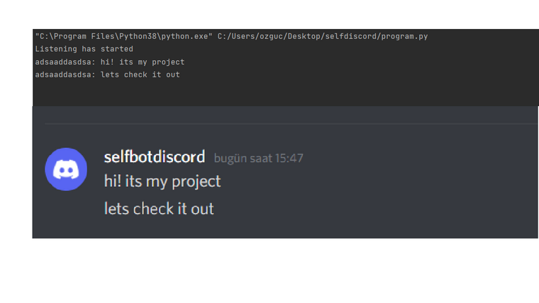
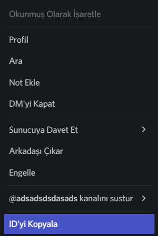
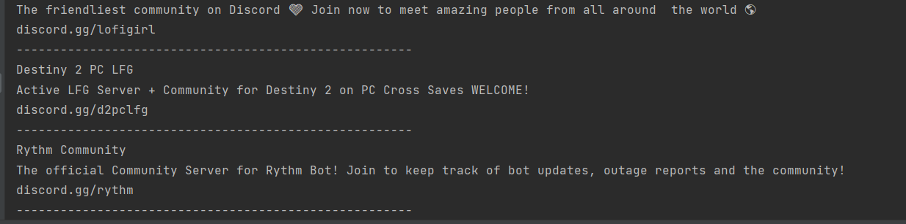
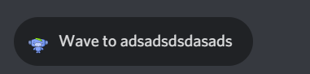
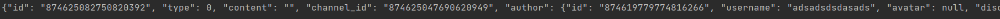
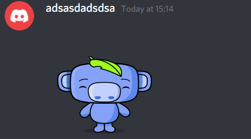

##Version
```python
import selfbotdiscord
selfbotdiscord.version()
```

##Commands
```python
import selfbotdiscord

selfbotdiscord.send_message(token="token here",channel_id="your channel id",message="Hello World!")
```
**In this way, you can send messages via the discord api!**

```python
import selfbotdiscord
selfbotdiscord.join_server(token="token here",server_id="discord.gg/(here is the server id tike discord.gg/neptun)")
```
**You can join servers with this code**
```python
import selfbotdiscord
selfbotdiscord.edit_message(token="your token here",channel_id="message in which channel id",message_id="message id",message_content="new message content")
```
**You can edit messages with this code**
```python
import selfbotdiscord
selfbotdiscord.delete_message(token="your token here",channel_id="message in which channel id",message_id="message's id")
```
**You can delete messages with this code**

```python
import selfbotdiscord
selfbotdiscord.typing(token="your token here",channel_id="your channel id where will the typing effect")
```
**You can make typing effect with this code**
```python
import selfbotdiscord
selfbotdiscord.create_role_name_new_role(token="your token here",guild_id="guild id")
```
**You can create a role name, name is "new role"**
```python
import selfbotdiscord
selfbotdiscord.logging_message(token="your token here")
```
**In this way, all the messages (from the servers / your dms) that come to you in the discord are instantly written to the console.**


```python
import selfbotdiscord
selfbotdiscord.send_friend_request(token="your token here",user_id="Discord id of the person to who the friend request will be sent")
```

```python
import selfbotdiscord
selfbotdiscord.remove_friend(token="your token here",user_id="Discord id of the person to who the friend request will be remove")
```
**You can remove friend easily**

```python
import selfbotdiscord
selfbotdiscord.last_dms(token="token here")
```
**You can read last dms on your account!**
```python
import selfbotdiscord
selfbotdiscord.public_servers(token="token here",how_much_server="maximum 48 server per page")
```
**Discord pulls public servers and assigns them as a list.**

```python
import selfbotdiscord
selfbotdiscord.check_token(token="your token here")
```
**if your token is valid result is : Your account was working
if your token isn't working the result is : Your account was suspended**
```python
import selfbotdiscord
selfbotdiscord.wawe_to(token="token",channel_id="channel id")
```
**You can throw a waving sticker on a newly opened DM!**




```python
import selfbotdiscord
selfbotdiscord.kick_user(token="token here",guild_id="guild id here",member_id="the member id here")
```

```python
import selfbotdiscord
selfbotdiscord.ban_user(token="token here",guild_id="guild id here",member_id="the member id here")
```

**You can kick and ban user with this code**