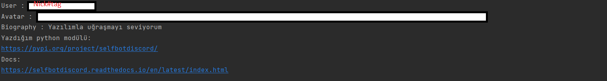
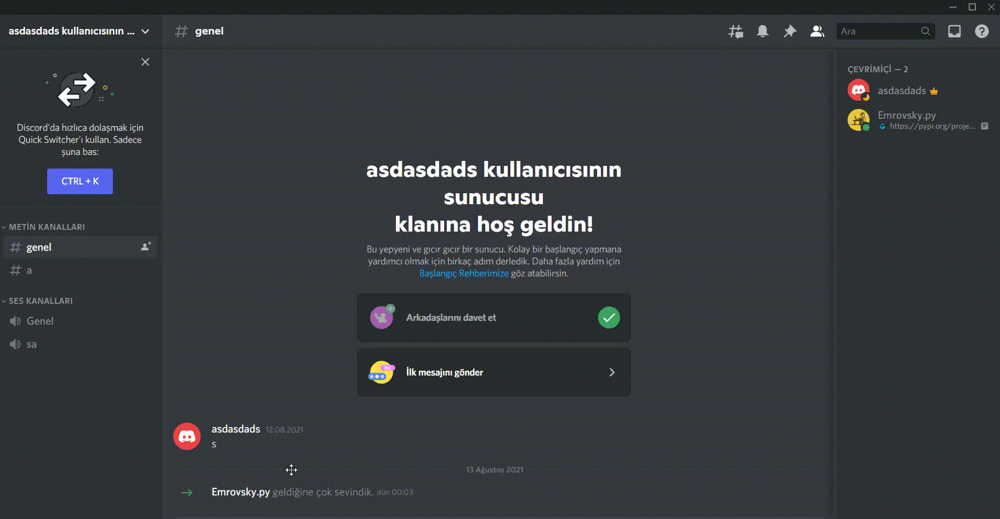

###
V10 Update
```python
import selfbotdiscord
selfbotdiscord.audit_logs(token="token here",guild_id="guild id here")
```
You can see audit logs with this code.

```python
import selfbotdiscord
selfbotdiscord.gift_code("discord.gift/(gift_code_here)")
```
You can check if the gift code is correct/wrong!

```python
import selfbotdiscord
selfbotdiscord.avatar(token="token",user_id="user id")
```


```python
import selfbotdiscord
selfbotdiscord.delete_channel(token="token",channel_id="channel id")
```
You can delete channel easily
```python
import selfbotdiscord
selfbotdiscord.get_all_channels(token="token",guild_id="guild id")
```
You can get all channel id's information with this code

```python
import selfbotdiscord
selfbotdiscord.channel_webhooks(token="token",channel_id="channel id")
```
You can get all webhooks information in the channel

```python
import selfbotdiscord
selfbotdiscord.join_voice_channel(token="token here",driver_path=r"like C:\Users\user\Desktop\chromedriver.exe",guild_id="guild id",xpath="xpath",how_much_second="like 60")
```

token = your discord  account token 

driver path : install the [chrome driver](https://chromedriver.chromium.org/downloads) and copy the path

guild id = voice channel in the discord server's id

xpath : look at the gif


how_much_seconds = how many seconds do you stay in the sound room

